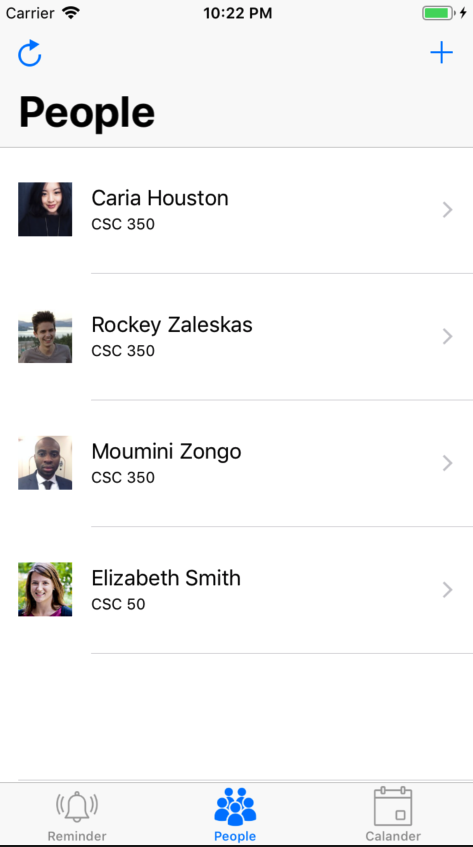

#    Reminder App 
## BMCC Software Development Project

### What Used?
- Swift 5 and Xcode
- CocoaPods
- SwipeCellKit: to delete a table view cell with a swipe
- RealmSwift: to persist data for a better user-experience
- ChameleonFramework: to color table view cells in a beautiful way

### What it does?
Helps Professors/bosses to get to know and remember their students/employees informations so that they can make closer connections.

### Demo
Welcome Page                 |2                               | 3
:---------------------------:|:------------------------------:|:------------------------------:
             |             | 

1                            |  2                             | 3
:---------------------------:|:------------------------------:|:------------------------------:
            |           | 
